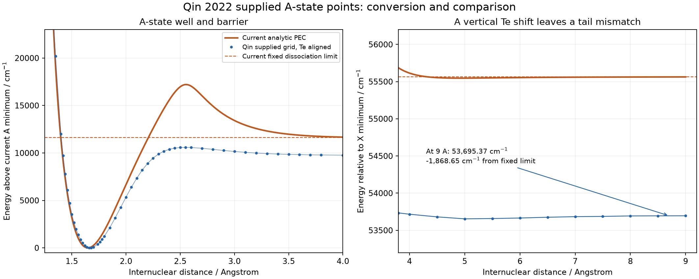

# Qin 2022 A-state reference for AlF

The complete supplied A1Pi grid has been extracted, aligned to the current
adiabatic A-state minimum, and validated in native Duo through J=98. This
package supplies a **reference constraint**, not a new accepted spectroscopic
model. The existing selected X/A PECs remain unchanged.

## Source and units

Source supplied by the user: `C:/temp/AlF/Potential energy.txt`.
The byte-identical archive is `Potential_energy_original.txt`, SHA256
`581b7e8593afa721d9d170d73c243141006c8faaa90f10ad6cafb3650eb686be`.

Associated paper: [Qin, Bai and Liu, MNRAS 510, 3011--3018 (2022)](https://academic.oup.com/mnras/article/510/2/3011/6460490),
DOI 10.1093/mnras/stab3598. It describes icMRCI+Q with aug-cc-pCV5Z-DK and
scalar relativistic corrections, and lists a numerical PEC supplement.
The file's attribution is the user's supplied association; its numerical
disagreement with the paper's spectroscopic table is documented below.

There are seven separate **radius/energy pairs**. The A1Pi columns are 7 and 8
(one-based). Each state has its own radial grid: for example one row has
X at 1.72 A but A at 1.74 A. Extraction must not pair column 1 with column 8.
Missing trailing columns are absent data, not zero-valued energy points.

All 66 A-state pairs from 1.05 to 9.00 A are retained. The file explicitly
labels distance in Angstrom. Energies are treated as cm-1, consistent with
the associated paper's energy convention and the magnitude of the X well;
the file header itself does not label the energy unit. No Hartree or bohr
conversion is applied to this file.

## Alignment

The grid's smallest A energy, -9771.80 cm-1 at 1.66 A, is aligned to the
actual lower adiabatic A minimum of the selected model, rather than its
auxiliary diabatic V0 or a rovibrational band origin:

```
Te_target = 43949.99358272087 cm-1
V_Duo(r) = V_file(r) + 53721.79358272087 cm-1
```

This is a constant vertical shift only. The radial positions, relative energy
differences and all original observations are preserved. The alignment
explicitly uses the **sampled minimum**. A cubic interpolation estimates a
minimum of -9780.1233 cm-1 at 1.669317 A, about 8.32 cm-1 lower; that interpolation
is only a diagnostic and does not create new fitting points. Printed decimal
places record the arithmetic, not the accuracy of the electronic structure.

## Quantitative implications and unresolved source discrepancy

| Quantity from the supplied A grid | Value |
|---|---:|
| Sampled barrier radius | 2.55 A |
| Barrier energy on source zero | 815.72 cm-1 |
| Barrier above sampled well minimum | 10587.52 cm-1 |
| Barrier above the 9 A endpoint | 842.14 cm-1 |
| Endpoint minus sampled minimum | 9745.38 cm-1 |
| Shifted endpoint at 9 A | 53695.373583 cm-1 |
| Current fixed common dissociation limit | 55564.024710 cm-1 |
| Endpoint minus fixed limit | -1868.651127 cm-1 |

The endpoint is a finite-distance value, not an independently determined
asymptote. Relative to the source zero rather than the endpoint, the barrier
is 815.72 cm-1 and the sampled depth is 9771.80 cm-1. Either convention is
substantially different from the current PEC and from the tabulated
**De(A)=13682.94 cm-1** in the paper's Table 2. The supplied sampled A/X minima
also imply Te=47917.98 cm-1, versus **44542.07 cm-1** in that table. The source
grid's minimum interpolation changes these comparisons by only tens of cm-1.
No constant shift can reconcile a well-depth discrepancy of several thousand
cm-1. These differences have not been attributed to a particular cause.

Consequently, the data can be used as a documented soft shape hypothesis, but
their agreement with Table 2 and the chosen dissociation reference needs to
be resolved before treating their absolute depth as an accurate physical
constraint. The existing common limit has not been silently changed to match
the grid. No vibrational cutoff or lifetime is inferred from this conversion.



## Duo inputs and weights

- `inputs/A_reference_angstrom_cm-1.dat`: all converted/aligned points.
- `inputs/A_reference_PS1997.inp`: requested native Weighting block.
- `inputs/AlF_with_reference_PS1997.inp`: complete input with that block.
- `inputs/A_reference_fixed_weights.inp`: explicit initial PS1997 weights.
- `inputs/AlF_with_reference_fixed_weights.inp`: preferred complete input for
  the present local Duo build.

The parent is numbered `poten 2`, hence the reference uses `abinitio poten 2`.
Its symmetry remains A1Pi, Lambda=1, multiplicity=1. Both variants use
fit_factor=100 and the requested PS1997 alpha=0.001, cutoff=18000 cm-1.

In the current local Duo build, a live `Weighting PS1997` directive gives
positive weights to the 20 synthetic short-range extrapolation points it
generates in addition to the 66 supplied points. These are not ab initio
observations; even the PS1997 floor can matter because the short-range
residuals are very large. `fit.pot` confirms this behavior.

The preferred version writes the same **initial** native PS1997 weights in
column 3 and omits the live Weighting directive. All 20 synthetic weights then
remain zero. Its weights are held fixed during fitting, not recomputed as the
PEC changes. No Duo executable or source modification was required.

The ready inputs retain itmax=0 for evaluation. They include the full supplied
experimental fitting block and the selected analytic parameters. Adding the
reference alone leaves the calculated spectrum byte-for-byte unchanged.

## Validation and trial

`diagnostics.json`, `conversion.json` (inside inputs), and `extraction.json`
record the source hashes, exact shift, radial-column mapping, and validation.
Native Duo checks for both weighting variants cover J=0--98 and verify all
66 reference energies, the synthetic-point weights, and unchanged parameters,
fit flags, observations and baseline spectrum. Six scientific data-integrity
tests cover independent radii, incomplete/blank cells, physical unit conversion,
non-finite data, duplicate radii, and explicit weighting syntax.

A limited native fitting trial and its independent zero-iteration assessment
are recorded in `TRIAL.md` and `trial_result.json`. These do not establish
convergence, an optimum fit or a bound-state count. Rejected trial parameters
are kept under the ignored calculation directory, not selected as a model.

The existing `refine.py` outer acceptance function still scores experimental
energies only; it is not suitable for accepting a joint PEC/energy objective
without extending that score. Its legacy minimum barrier height also predates
this source grid. The preparation and diagnostic tools here do not silently
change either the objective or those shape assumptions.

## Reproduction from repository root

With the AlF requirements installed, generate a new directory:

```powershell
python AlF/refine_tools/prepare_qin_reference.py AlF/abinitio/Qin_2022/Potential_energy_original.txt AlF/refined_model/27AlF_X_A_coupled_pec.inp AlF/pecfit_runs/qin_new --energy-unit cm-1 --fit-factor 100
python AlF/refine_tools/run_native.py AlF/pecfit_runs/qin_new/inputs/AlF_with_reference_fixed_weights.inp AlF/pecfit_runs/qin_check --duo C:/sergei/programs/Duo/build/ifx/duo.exe --jmax 98 --precise
python -m unittest discover -s AlF/refine_tools -p test_abinitio_reference.py -v
```

`trial_abinitio_reference.py INPUT OUTPUT --duo EXE --scale 0.1` freezes all
objects except the already marked A-PEC parameters, makes a bounded-duration
native proposal run, extracts its first complete parameter proposal, and
independently recalculates the spectrum and shape diagnostics. It never
automatically promotes the candidate.
