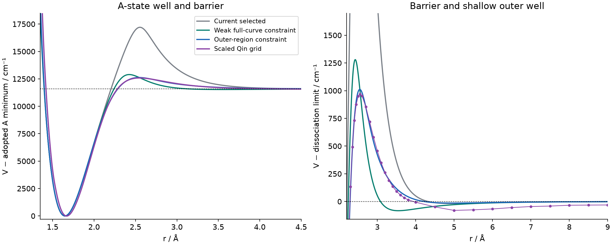
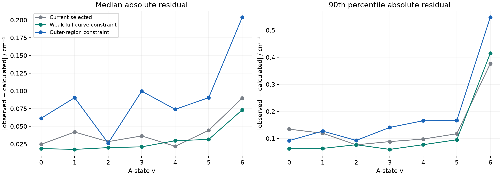

# AlF: uniformly scaled Qin A-state PEC

The requested scaling and native Duo grid calculations are complete. Scaling
brings Qin's asymptote onto the adopted common Al + F limit and gives a much
lower barrier than the current analytic model. It **does not reduce the
inner-well bound progression to v=6 or 7**: the scaled grid supports **17
inner-well bound levels, v=0–16, at J=1**. A weak constraint improves agreement
with the reference shape while approximately retaining experimental accuracy.
A strong constraint on the entire curve is incompatible with the present
quality of the spectroscopic fit in the tested parametrization.

These are diagnostic candidates. The selected model in `refined_model/`
has not been replaced.

## Scaling and energy zero

All 66 supplied A-state points retain their original radii, 1.05–9 Å. The
correct independent A radius/energy pair is columns 7 and 8 of the original
file. No radial shift, stretch, additional reference points or Hartree
conversion is applied. The working energy unit remains cm⁻¹, as in the
preceding Qin extraction.

The primary transformation is

\[
 V_{scaled}(r)=T_{e,target}+s\,[E_{file}(r)-E_{file,min}],\qquad
 s=\frac{D_{target}-T_{e,target}}{0-E_{file,min}}.
\]

| Quantity | Value / cm⁻¹ |
|---|---:|
| Adopted absolute Al + F limit, on the X-minimum zero | 55564.024710 |
| Current model's actual adiabatic A minimum | 43949.993583 |
| Target A well depth, limit minus A minimum | 11614.031127 |
| Supplied Qin sampled A minimum | −9771.800000 |
| Primary file-derived A depth, assuming separated-atom zero = 0 | 9771.800000 |
| Qin value at the finite 9 Å endpoint | −26.420000 |

Thus **s = 1.18852525914**. The sampled barrier becomes 56533.52853 cm⁻¹,
969.50382 cm⁻¹ above the adopted limit and 12583.53495 cm⁻¹ above the adopted
A minimum. Its radius remains about 2.55 Å. The 9 Å endpoint remains
31.40084 cm⁻¹ below the adopted limit.

This target is an **adopted empirical depth**, obtained from the project's
fixed X dissociation limit and fitted A Te. It is not an independent precise
experimental measurement of A-state De, and the displayed digits do not
represent experimental uncertainty. The auxiliary EMO `AE=80000` inside
the coupled construction is not the physical A dissociation energy.

There is an unresolved provenance difference: the supplied numerical grid
does not reproduce De(A)=13682.94 cm⁻¹ in
[Qin, Bai & Liu (2022), Table 2](https://academic.oup.com/mnras/article/510/2/3011/6460490).
Using that table value to scale this particular grid would not give the
requested target well depth. This experiment therefore uses the **depth of
the supplied grid**, not the inconsistent tabulated value.

As a sensitivity check, treating the 9 Å endpoint itself as the source limit
gives De(file)=9745.38 cm⁻¹ and **s=1.19174738464**. This places that endpoint
at 55564.02471 and gives a barrier 1003.62 cm⁻¹ above it. The inner bound
count remains 17. Neither finite-endpoint convention establishes a reliable
new long-range C6 coefficient.

Alignment is to the sampled minimum, consistent with the previous conversion.
Interpolation between supplied points puts the continuous minimum about
10 cm⁻¹ lower. We did not silently apply an additional shift after scaling.

## Native Duo grid and bound-state results

`inputs/AlF_grid_nominal_zero.inp` replaces potential 2 by the scaled **actual
GRID PEC**, preserving A¹Π symmetry and all other physical fields. The
calculation removes FITTING and uses INTENSITY / absorption / unbound /
states_only with the requested thresholds: THRESH_BOUND=0.01,
THRESH_bound_rmax=4 Å, THRESH_DELTA_R=1 Å, and print_bound_density. Native
Duo ran J=0–98, a 0.7–8 Å grid with 1001 points, and vmax=180 for both states.
The source file ends at 9 Å; the extended check stays within that radius.
Duo extrapolates only the unobserved short-range part below 1.05 Å.

At J=1, in the f parity:

| Calculation | Inner bound levels | Outer/diffuse levels below adopted limit | Total below adopted limit in this box |
|---|---:|---:|---:|
| Scaled grid, nominal zero, 8 Å / 1001 points | 17 | 7 | 24 |
| Scaled grid, nominal zero, 9 Å / 1401 points | 17 | 9 | 26 |
| Scaled grid, endpoint convention, 9 Å / 1401 points | 17 | 5 | 22 |
| Weak full-curve analytic constraint, 8 Å / 1001 points | 17 | 6 | 23 |
| Weak full-curve analytic constraint, 9 Å / 1401 points | 17 | 6 | 23 |
| Outer-region analytic constraint after native polish, 8 Å | 17 | 3 | 20 |

The independent uncontracted radial calculation uses the **actual native
Potential_functions.dat grid**, the AlF reduced mass, and Duo's supplied
singlet-Pi diagonal convention J(J+1)−2. Inner levels require more than 50%
probability inside the inner barrier as well as energy below dissociation.
For the scaled grid, all 17 have inner probabilities above 0.99999996.
The independent f-parity energies agree with native six-decimal .states
energies to about 5×10⁻⁷ cm⁻¹ for v=0–6. Increasing the box and mesh changes
the 17 inner energies by at most 0.000956 cm⁻¹ and does not change their count.
For the weak analytic candidate those energies are unchanged at .states
printing precision in the same box/mesh comparison.

The **outer spectrum is not converged**: changing the box adds diffuse levels,
and the source energy-zero convention changes how many lie below the adopted
limit. Do not interpret 24 or 26 as an established total number of molecular
bound levels. The native `b` flag tests localization and is not a general
inner-well assignment or a tunnelling lifetime. Above-limit localized
levels also occur; no resonance widths or lifetimes are inferred here.

All 1103 supplied unique A assignments, including the 12 pre-existing
zero-weight records, are localized and below dissociation in the J≤98 grid
calculation. The data reach J=92 overall and J=61 for v=6. The independent
grid calculation retains 14 inner bound levels at J=61, 11 at J=83 and 10
at J=92. Bound levels also remain at the calculation cutoff J=98, so this
scan does not establish a highest possible J.

## Shape versus experimental agreement

Every residual statistic below uses fresh native Duo energies, the same
1834 merged input records, and their original weights: 1091 positive A
records and 731 X records. The existing 12 zero-weight records remain in the
inputs and diagnostics. No new experimental levels were excluded. The grid
calculation uses six-decimal .states energies; analytic models use the
native twelve-decimal energy output. All native fitted assignments agree
with the supplied state/v labels.

| Model | A weighted RMS / cm⁻¹ | A median absolute residual / cm⁻¹ | Barrier above dissociation / cm⁻¹ |
|---|---:|---:|---:|
| Current selected model | 0.582176 | 0.034531 | 5590.92 |
| Scaled grid, without experimental refinement | 29.720728 | 20.691642 | 969.50 |
| Weak full-curve constraint | 0.584483 | 0.024046 | 1279.96 |
| Outer-region constraint, then native polish | 0.593307 | 0.075922 | 1011.31 |
| Strong full-curve constraint | 24.017059 | 19.853611 | 960.57 |

The weak full-curve candidate raises A RMS by **0.40%** while lowering the
median residual by about **30%**. Its weighted mismatch to the scaled PEC
drops from 1576.84 to 715.85 cm⁻¹ over all original reference points, and
from 1925.98 to 284.62 cm⁻¹ for r≥2.2 Å. Its outer minimum is about 83 cm⁻¹
deep at 3.55 Å: smooth and shallow, but displaced from the supplied Qin
outer minimum near 5 Å. The v=6 residual distribution still deserves attention.

The outer-region candidate reproduces the barrier radius and outer shape
better: its reference RMS for r≥2.2 Å is 34.45 cm⁻¹, its barrier is at
2.543 Å, and its shallow outer minimum is about 14.4 cm⁻¹ deep near 4.96 Å.
Its overall RMS increase is about 1.9%, but its median residual more than
doubles. Before the native polish its A RMS was 0.592329 and median about
0.0653 cm⁻¹; the three native updates did not improve the experimental
statistics. It is a shape-focused alternative, not an automatic replacement.

The strong full-curve candidate follows the scaled reference closely
(37.32 cm⁻¹ reference RMS) at a large cost to spectroscopy. Uniform energy
scaling cannot correct Qin's equilibrium distance or independently correct
the curvature and anharmonicity. The file's interpolated minimum is near
1.669 Å, whereas the spectroscopic model requires about 1.6485 Å.





## Fitting method and safeguards

`fit_scaled_qin.py` optimizes all positive A observations using a contracted
A(f) Hamiltonian, with native e/f coupling corrections fixed only inside
the optimizer. It varies 13 A parameters: inner Te/Re/B0–B6, repulsive
amplitude, and coupling amplitude/radius/B0. The X PEC, BOB, Lx, common
asymptote, C5/C6, and equal PL=PR=6 are retained. Fresh full X/A native Duo
calculations provide every reported fit statistic; the surrogate is not
used as the final spectroscopic evidence.

The declared objective is sum(w_exp·loss(ΔE)) plus
strength·sum(w_PEC·ΔV²)/sum(w_PEC), with shape penalties. The weak full-grid
case uses strength=1e−5 and Cauchy scale 0.1 cm⁻¹ for experimental residuals.
The outer case uses strength=0.01, the same Cauchy scale, and zero reference
weight below 2.2 Å. The strong case uses strength=100 and ordinary squared
experimental residuals. These define the external objective and are **not
claimed to reproduce native Duo's weight normalization exactly**. The
supplied native blocks state their fit_factor explicitly.

The outer candidate also received three native robust updates with the
single scaled outer reference retained, ROBUST=1e−5, fit_scale=0.1, and
only the nine inner A parameters free. The last complete proposal was
extracted and assessed in a separate zero-iteration calculation. Native
proposal stdout preceding an update was never used to certify that update.

Explicit, fixed initial PS1997 weights avoid this Duo version assigning
positive weights to synthetic short-range extrapolation points. The
reference block contains only the original 66 radii. Shape checks cover
0.7–1000 Å, requiring one inner minimum, one barrier, a shallow outer well,
finite asymptotic behavior and the retained long-range limit. Trial limits
allow a lower barrier and an outer well up to 100 cm⁻¹ deep; the original
production defaults were not weakened.

Early diagnostic templates inherited the previous unscaled reference;
this was unused by the external objective and did not affect their
zero-iteration energies. Those raw runs remain historical evidence.
Delivered candidates have exactly one scaled reference; they were rerun
natively after template cleanup, including the native polishing steps.
The input-construction regression test now prevents this inheritance.

## Files and reproduction

The `inputs/` directory contains both scaling conventions, actual GRID
models and standalone/reference-enabled inputs. `candidates/` contains the
weak full-curve, strong full-curve and outer-region analytic alternatives.
`summary.json` records machine-readable fit, shape and convergence results.
`evidence/` contains residuals and compact bound diagnostics; complete native
inputs, stdout, .states, optimizer histories and manifests are under
`AlF/pecfit_runs/qin_scaled/`. Source data and provenance remain in the
adjacent `Qin_2022` package.

From the repository root, with NumPy/SciPy/Matplotlib available, use new
output directories:

```powershell
python AlF/refine_tools/scale_qin_reference.py AlF/refined_model/27AlF_X_A_coupled_pec.inp AlF/abinitio/Qin_2022/A_original_angstrom_cm-1.dat scaled_inputs
python AlF/refine_tools/bound_states.py scaled_inputs/AlF_grid_nominal_zero.inp scaled_grid_run --duo C:/sergei/programs/Duo/build/ifx/duo.exe --jmax 98 --npoints 1001 --vmax 180 --dissociation 55564.02471
python AlF/refine_tools/grid_bound_spectrum.py scaled_grid_run --js 1 61 83 92
python AlF/refine_tools/run_native.py AlF/abinitio/Qin_2022_scaled/candidates/weak_full.inp weak_recheck --duo C:/sergei/programs/Duo/build/ifx/duo.exe --jmax 98 --precise
python AlF/refine_tools/coupled.py weak_recheck --jmax 98
python -m unittest discover -s AlF/refine_tools -p "test_*.py" -v
```

`bound_states.py --dissociation` specifies an absolute input-PEC asymptote;
the program subtracts the native X zero-point energy before classifying
.states energies. This is required for an arbitrary GRID potential.
