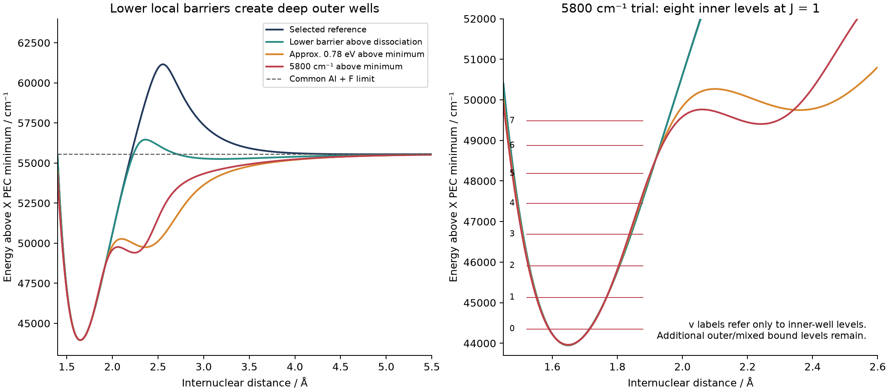
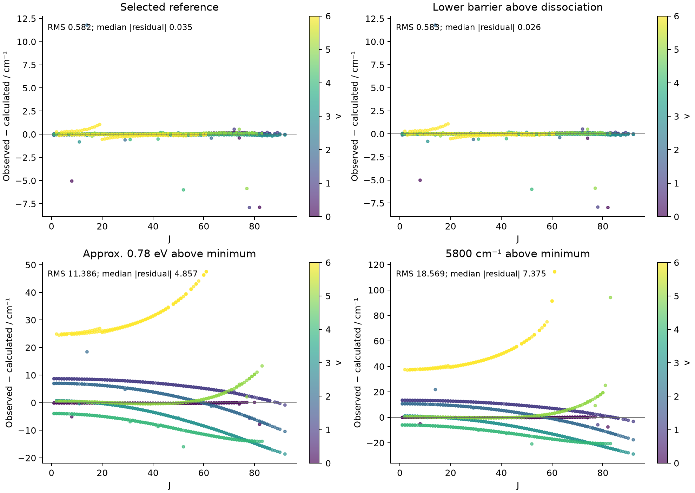

# AlF: testing a lower A-state barrier

The requested hypothesis was tested, including direct native Duo refits and constrained A-state refinements. A smooth trial with eight inner-well levels (v = 0–7 at J = 1) was obtained, but its experimental agreement is much worse and it creates a deep outer well containing additional bound states. **It is a diagnostic counterexample, not an accepted replacement model.** The selected X/A model is unchanged.

## Fit and state-count comparison

All heights below are measured from the actual adiabatic A minimum or the common Al + F dissociation limit, as explicitly labelled. The nominal 1000 cm⁻¹-above-limit trial relaxed to 894.2 cm⁻¹ in its allowed fitting window. The approximate 0.78-eV trial reached 6310.8 cm⁻¹ (0.78244 eV) above the actual minimum. The final eight-level trial reached 5800.17 cm⁻¹ (about 0.7191 eV).

| Model | Barrier above A minimum / cm⁻¹ | Barrier above dissociation / cm⁻¹ | Inner levels below dissociation, J=1 | A RMS / cm⁻¹ | A median absolute residual / cm⁻¹ |
|---|---:|---:|---:|---:|---:|
| Selected reference | 17205.0 | +5590.9 | 17 | 0.5825 | 0.0347 |
| Lower barrier above dissociation | 12508.3 | +894.2 | 17 | 0.5834 | 0.0259 |
| Approx. 0.78 eV above minimum | 6310.8 | -5295.5 | 9 | 11.3858 | 4.8566 |
| 5800 cm⁻¹ above minimum | 5800.2 | -5801.5 | 8 | 18.5689 | 7.3754 |

The table uses all 1097 positive-weight original A records, retaining the six repeated assignments and excluding only the original twelve zero-weight records from the statistics. All 1109 original A records and 731 X records are supplied in each residual file. No additional observations were discarded. Native fits use 1103 unique A levels, including the zero-weight levels; duplicate means are expanded back to the source records for this comparison. Every native evaluation matched all supplied assignments. X PEC, X BOB, the absolute limit and A C5/C6 were kept fixed. X RMS remains approximately 0.0027 cm⁻¹; its energies can shift slightly through X/A coupling.





## What “vmax = 7” means in this trial

The final barrier is at r = 2.06085 Å and 49762.48 cm⁻¹ above the X potential minimum. The common dissociation limit is 55564.02471 cm⁻¹. Consequently the curve must rise again after the local maximum to reach its asymptote. With the retained attractive C5/C6 tail, the lower-barrier construction develops an outer minimum at approximately 2.241 Å and 49404.10 cm⁻¹ — about 6160 cm⁻¹ below dissociation. This is a substantial change in the physical PEC, not a shallow van der Waals well.

At J = 1 the final model has eight levels with more than half their probability inside the local barrier and energy below that barrier. Their inner probabilities range from 0.9685 to essentially 1. There are nevertheless **44 A(f) eigenlevels below dissociation in the 8 Å box**, and 45 in a 12 Å box. The latter is a lower bound on the full bound spectrum, not a claim that the diffuse outer spectrum is converged. Above the local barrier, “inner v” based on a 50% probability cutoff ceases to be a reliable spectroscopic assignment.

Native Duo with the requested FITTING-off INTENSITY/UNBOUND/STATES_ONLY block confirms the 44 below-limit f-parity levels at J = 1. Of those, **37 carry the b flag**, including outer/mixed levels; only eight are the inner-well vibrational progression. Thus THRESH_BOUND=0.01 and THRESH_bound_rmax=4 cannot enforce a maximum inner v by themselves. The printed v label is also not a general inner-well quantum number. Counts here exclude M and nuclear-spin degeneracies and refer to one f parity unless stated otherwise.

## Observed rotation and numerical checks

The source reaches A v = 6 and J = 92 overall; v = 6 reaches J = 61. At each observed per-v maximum J, the final trial still has an inner-localized level below the rotational barrier. For v=6, J=61, its inner probability is 0.9389 and it is 340.3 cm⁻¹ below that effective barrier. For v=5, J=83, the values are 0.9946 and 512.5 cm⁻¹. These are localization checks of model levels, not successful fits: the corresponding energy residuals remain large. See the per-model `*_observed_J_caps.csv` tables.

The A(f) radial calculation uses the full uncontracted sinc DVR with 801 points, the native AlF reduced mass, and Duo's J(J+1)−2 convention for this supplied singlet-Pi Hamiltonian. Full X/A native Duo handles both parities for every observed level through J=98. Increasing the final trial to 1001 radial points and vmax=180 changes the observed energies by at most 2.4e-07 cm⁻¹. Therefore the roughly 18.57 cm⁻¹ A RMS is not a basis-convergence error.

The eight low-J inner levels survive both the 1001-point check and extension to a 12 Å, 1401-point box. Native six-decimal `.states` energies for those levels agree with the independent radial calculation to 4.96e-07 cm⁻¹. Diffuse outer levels are less converged: across the full 44-level set, the 801/1001 discretizations differ by up to 0.006694 cm⁻¹, and the larger box adds another level. No radiative lifetime, tunnelling width or predissociation lifetime has been inferred.

An earlier 5800-cm⁻¹ trial also received the complete native J=0–98 UNBOUND calculation (53,090 states). Its A RMS was 19.34 cm⁻¹; all 1103 supplied unique A assignments were localized and below the common limit. This is retained as separate evidence and is not confused with the final minimum-referenced trial, for which the native UNBOUND check is J≤1 and the full experimental energy validation is J≤98.

## The 0.763–0.78 eV reference

[Andreazza & de Almeida (2014)](https://academic.oup.com/mnras/article/437/3/2932/1034811) report a 0.763 eV hump at 4.8 bohr and discuss it as a barrier suppressing association of incoming Al + F atoms at low collision energy. Their collision formula uses the potential relative to separated atoms. This supports interpreting the reported hump above dissociation, rather than above Te. The sentence giving the hump does not explicitly restate its zero; the interpretation is inferred from the collision-energy context, not a newly recovered quotation from the original 1988 paper.

[Qin, Bai & Liu (2022), Table 1](https://academic.oup.com/mnras/article/510/2/3011/6460490) independently assign X and A to the same ground-atom asymptote. A 0.78-eV barrier above the present A minimum would be near 50241 cm⁻¹ on the X-minimum scale, already about 5323 cm⁻¹ below that common dissociation limit. The retained X/A separation to dissociation cannot be removed merely by lowering a local barrier. The earlier literature note has been clarified to distinguish the contextual energy-zero inference from the reported number.

The highest observed v is an observational limit; it does not establish that higher vibrational levels are absent. A fit constrained to seven or eight *total* bound levels would require additional, independently justified changes to the potential and/or dissociation physics. The numerical trials here do not prove that every possible alternative functional form fails; they show that the tested low-barrier versions of this two-state, fixed-asymptote model are unsuitable replacements.

## Methods, files and reproduction

- The lower-above-dissociation trial used four native robust-fitting rounds, three proposal iterations each, ROBUST=0.00001, with fresh all-J validation and an explicit relaxed shape profile. Its robust median improves while its ordinary RMS increases slightly; it still has 17 inner bound levels.
- The below-dissociation trials began by matching the inner PEC while imposing a lower peak, then fitting experimental energies. Ordinary native proposals lost the required local maximum and were rejected. A constrained A(f) Hamiltonian fit then varied A Te/Re/B0–B6 and, in additional trials, repulsive amplitude and crossing parameters. Equal PL=PR=6 and fixed C5/C6 were retained. Native e/f corrections were frozen only inside that surrogate; every reported residual uses a fresh complete native Hamiltonian. The final eight-level trial constrained the actual adiabatic minimum, not the auxiliary EMO Te or Re value. The approximate 0.78-eV run hit its iteration limit and is labelled exploratory, not a proven optimum.
- Shape profiles allowing outer wells several thousand cm⁻¹ deep were used solely to explore the hypothesis. Passing those relaxed profiles does not certify physical adequacy. All published trial PECs remain finite on 0.7–1000 Å; the original production shape constraints remain the default and reject these alternatives.
- `minimum_5800_diagnostic.inp` is the final eight-inner-level trial; `minimum_078_diagnostic.inp` and `above_limit_1000_diagnostic.inp` are comparison hypotheses. These are complete native Duo inputs, clearly separated from `refined_model/27AlF_X_A_coupled_pec.inp`.
- `summary.json`, spectra, original-record residuals, observed-J-cap tables, PNG/PDF figures and native J=1 f-level tables accompany this report. Full inputs, stdout, .states, manifests, trial histories and optimizer snapshots are retained under `AlF/pecfit_runs/low_barrier/`.
- Reusable tools added: `low_barrier_seed.py`, `fit_low_barrier.py`, `analyze_low_barrier.py`; `refine.py --shape-config` accepts explicit trial bounds without changing production defaults. `barrier_spectrum.py` now scans at least to dissociation even if the local barrier is lower. The native localization summary no longer calls all b-labelled states inner-well states. Ten regression checks pass.

For a fresh native validation, use a new output directory:

```powershell
python AlF/refine_tools/run_native.py AlF/barrier_trials/minimum_5800_diagnostic.inp AlF/pecfit_runs/low_barrier_recheck --duo C:/sergei/programs/Duo/build/ifx/duo.exe --jmax 98 --precise
python AlF/refine_tools/coupled.py AlF/pecfit_runs/low_barrier_recheck --jmax 98
python AlF/refine_tools/bound_states.py AlF/barrier_trials/minimum_5800_diagnostic.inp AlF/pecfit_runs/low_barrier_unbound_recheck --duo C:/sergei/programs/Duo/build/ifx/duo.exe --jmax 1 --npoints 1001 --vmax 180
python AlF/refine_tools/barrier_spectrum.py AlF/barrier_trials/minimum_5800_diagnostic.inp AlF/pecfit_runs/low_barrier_radial_recheck --js 1 61 83 92 --npoints 801
```

The recommended next constraint is independent near-dissociation or lifetime evidence, rather than treating v=6 as an enforced dissociation cutoff. The current selected model remains available unchanged while those physical constraints are resolved.
