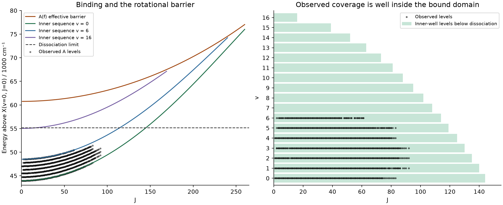
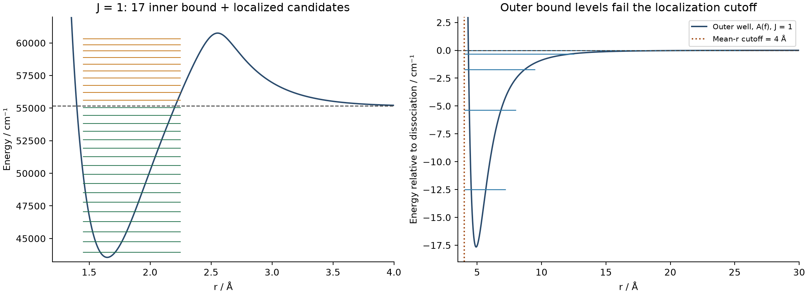

# AlF A¹Π: bound states, localization and the rotational barrier

The requested intensity calculation has been run on the selected refined model, with the FITTING block removed and the PEC/coupling parameters unchanged. The supplied J = 0–40 calculation was followed by J = 0–160 calculations, larger vibrational bases, and radial-box checks. A¹Π starts at **J = 1**, not J = 0.

The observations occupy only part of the supported bound spectrum. They do not require the potential to terminate at v = 6 or J = 92. Every one of the **1,109 retained original A-state records**, including the 12 zero-weight records and six duplicate assignments, matches a calculated level that is localized and below dissociation. There are 1,097 positive-weight records. The two original negative-J/negative-energy disabled records remain excluded.

## Observed limits and literature

The supplied data reach **v = 6** and **J = 92**. At v = 6 the largest observed J is **61**; J = 92 occurs in v = 1, 2 and 3. The highest observed A-state energy is 51,391.4294 cm⁻¹ (v = 5), about 3,772 cm⁻¹ below the model's dissociation limit.

The highest A¹Π vibrational level I could verify in the literature search is **v = 6**. Walter et al. directly measured the A¹Π(v = 6)/b³Σ⁺(v = 5) mixed levels in 2022. This agrees with the vibrational extent of this input. I found no verified higher A¹Π observation; this is a statement of verified coverage, not proof of an exhaustive historical maximum. The accessible primary papers did not establish a literature-wide largest J, so **J = 92 is specifically the maximum in the supplied experimental data**. Reports of a³Π levels through v = 8 refer to a different, triplet state. [Walter et al., J. Chem. Phys. 156, 184301 (2022)](https://arxiv.org/abs/2202.07920).

## Supported inner-well bound levels

Energy zero is X(v = 0, J = 0). Duo gives ZPE = **400.147627939163 cm⁻¹** relative to the X PEC minimum. Thus the supplied absolute asymptote 55,564.02471 cm⁻¹ is **55,163.8770820608 cm⁻¹ on the .states energy scale**. Comparing .states energies directly with 55,564.02471 would misclassify levels.

At J = 1 there are **17 inner-well vibrational levels below dissociation, v = 0–16**, in each parity. Across all J there are **3,248 inner-well rovibrational levels below dissociation: 1,624 e + 1,624 f**. Each parity level is counted once; the count excludes magnetic M degeneracy, nuclear-spin statistical weight, and hyperfine components. It also excludes additional diffuse outer-well levels discussed below.

| v | Largest observed J | Largest below-limit inner-well J, e and f |
|---:|---:|---:|
| 0 | 83 | 144 |
| 1 | 92 | 140 |
| 2 | 92 | 135 |
| 3 | 92 | 130 |
| 4 | 83 | 125 |
| 5 | 83 | 119 |
| 6 | 61 | 114 |
| 7 | — | 108 |
| 8 | — | 102 |
| 9 | — | 95 |
| 10 | — | 88 |
| 11 | — | 81 |
| 12 | — | 73 |
| 13 | — | 63 |
| 14 | — | 52 |
| 15 | — | 39 |
| 16 | — | 16 |

At J = 92 there are still **10 inner-well vibrational levels below dissociation (v = 0–9)**. For A(f), v = 0 lies at 55,036.2573 cm⁻¹ at J = 144, but 55,183.4228 cm⁻¹ at J = 145. It therefore crosses the asymptote between these two J values while remaining far below the rotational barrier.



## The rotational barrier

For this particular input, Duo's default diagonal-L² convention, absent an explicit L² curve, gives the A(f) radial effective potential

`V_eff(r,J) = V_A(r) + [16.857629194167 / 11.1484731837442] [J(J+1) − 2] / r²`.

Here r is in Å and energies are in cm⁻¹. The coefficient is ℏ²/(2μhc). Using J(J+1)−1 would not reproduce this input's convention. The f parity has no X¹Σ⁺ partner and can be checked directly with a single-channel Hamiltonian. The native calculations retain X/A rotational coupling for the e parity.

| J | Barrier position / Å | Barrier energy / cm⁻¹ above X(v=0,J=0) |
|---:|---:|---:|
| 1 | 2.55378 | 60,754.7991 |
| 40 | 2.55199 | 61,134.8418 |
| 92 | 2.54438 | 62,745.3878 |
| 144 | 2.53039 | 65,639.6749 |
| 200 | 2.50572 | 70,245.7479 |
| 260 | 2.45232 | 77,035.2303 |

Rotation raises both the well levels and the barrier but reduces the trapping depth relative to the well. Localized above-threshold solutions persist well beyond J = 144. They are **quasibound candidates**, not strictly bound levels. At very high J the last localized eigenvalues depend on the box and localization criterion; no unique maximum observable resonance J or lifetime is claimed here. The energy window was extended in independent radial checks, since the requested 70,000 cm⁻¹ cap cannot assess the entire high-J barrier region.

## What the b/u column means

For this executable's non-Landé output, the .states columns are:

`id energy g J parity e/f state v Lambda Sigma Omega b/u <r> tail_probability`

The final columns are a **localization flag**, mean radius in Å, and integrated probability in the last THRESH_DELTA_R = 1 Å of the radial grid. For the requested thresholds a level receives `u` if its tail probability exceeds 0.01 or its mean radius exceeds 4 Å. Neither test directly compares the energy to the dissociation limit.

- Below limit, `b`: the 3,248 compact inner-well bound levels counted above.
- Above limit, `b`: localized resonance candidates; a finite-box eigenvalue has no decay width.
- Below limit, `u`: possible diffuse outer-well bound levels; not necessarily unbound.
- Above limit, `u`: continuum box states or delocalized/broad resonance mixtures.

At J = 1 the larger native bases give **27 f-parity b-labelled levels: 17 below the limit and 10 above it**. Tightening the tail threshold from 0.01 to 0.001 reduces this to 26, with all 17 below-limit inner levels retained. The upper count must therefore not be used as a count of strictly bound vibrational states.

Printed v labels above threshold also include the ordering of diffuse/continuum basis states. For example, the next inner-well sequence member after physical v = 16 has energy 55,617.402696 cm⁻¹ but is printed as v = 41 in the 8 Å calculation and v = 63 in the 12 Å calculation. It is the inner-well v ≈ 17 resonance candidate, not physical v = 41 or 63. Above-threshold tracking requires wavefunction character/overlaps and stabilization, not simply the largest printed v.

## The shallow outer well

This PEC has a shallow outer minimum near 4.92 Å, about 17.66 cm⁻¹ below its asymptote. Such levels are deliberately rejected by the 4 Å mean-radius cutoff. Their count is not converged in the 8 Å box: the native J = 1 f calculation has three below-limit outer levels at 8 Å and four at 12 Å.

An independent, isolated A(f) outer-well calculation extended to 80 and 160 Å finds **five J = 1 outer bound levels** with approximate binding energies 12.49409, 5.37062, 1.73646, 0.32870 and 0.00773 cm⁻¹. Their mean radii are approximately 5.21, 6.03, 7.51, 10.54 and 23.54 Å. Across J = 1–14 this isolated f-channel model has 37 outer levels. Consequently the A(f) potential has 22 below-limit radial levels at J = 1: 17 inner + 5 outer, while only the 17 compact levels pass the requested localization cutoff.

This outer calculation uses a finite-difference radial Hamiltonian outside a wall at 3 Å, deep within the barrier, and checks radial step sizes of 0.005 and 0.0025 Å. It is a diagnostic of the specified A(f) potential, **not a completed outer-state count for the coupled e-parity X/A system**. These very weak levels are especially sensitive to long-range coefficients, atomic asymptotic structure and channel coupling; they have no experimental validation in the supplied data. Do not double the isolated f outer count to obtain a whole-molecule total.



## Lifetimes

The measured A¹Π(v = 0) radiative lifetime is **1.90 ± 0.03 ns**. This is a useful future transition-dipole validation target, not a barrier-tunnelling measurement. [Truppe et al., Phys. Rev. A 100, 052513 (2019)](https://arxiv.org/abs/1908.11774).

The 2022 doorway-state study uses a predicted unmixed A(v = 6) lifetime of about 2.05 ns and shows strongly state-dependent lifetimes caused by A(v = 6)/b(v = 5) mixing. The present X/A-only Hamiltonian omits b³Σ⁺ and its spin-orbit coupling. Matching those mixed-state lifetimes would require that extra physics. [Walter et al. (2022), section V](https://arxiv.org/abs/2202.07920).

`states_only` produces no Einstein-A sums and no predissociation widths. A radiative lifetime needs a validated transition-dipole curve and a sum over allowed decay channels. A predissociation lifetime needs a resonance-width calculation (for example stabilization plus a width method, scattering, or a complex absorbing potential). For a width Γ in cm⁻¹, τ_pred = 1/(2πcΓ), with the width convention specified. Radiative and nonradiative **rates**, not lifetimes, add. No lifetime has been inferred from the b/u flag here.

## Validation and scope

- Native J = 0–40 run: exact requested thresholds, states_only, no fitting.
- Native J = 0–160 runs: 100 then 180 contracted functions per state; identical 3,248 inner bound levels, maximum energy difference **0.000010 cm⁻¹**.
- Independent uncontracted sinc-DVR A(f) calculation: all 1,624 inner bound f levels agree with the native 180-function results within **0.00000051 cm⁻¹**, including .states rounding.
- Independent 601/801-point selected bound-level check: maximum difference **4.2 × 10⁻⁹ cm⁻¹**.
- Native J = 1 checks: 8 Å / 1001 points / 250 functions and 12 Å / 1601 points / 400 functions; the 17 inner bound levels persist.
- Original model SHA-256: `50b4a8c3255b49a51827cf5115cd1abdd20246f274fe2f3d91ddc1ac61ccee2d`; its parameters were not changed.
- The parser/preparation regression tests and a fresh native run using the final diagnostic driver passed.

These checks establish the spectrum of this chosen model, not the experimental accuracy of extrapolated high-v/high-J levels. The data reach only v = 6 and J = 92 and do not independently determine the barrier or all long-range parameters. The observed maxima are therefore coverage limits, not appropriate equality constraints on the number of bound states. A useful fitting safeguard is instead that every reliably observed level remains supported and that proposed curve changes preserve sensible barriers and predicted binding margins.

## Files and rerunning

The numerical tables and `summary.json` accompany this report. `observed_classifications.csv` retains all 1,109 raw retained A observations; `A_inner_bound_levels.csv` lists the 3,248 compact bound levels. `threshold_sensitivity.csv` separates below- and above-limit localization counts. Native inputs, stdout, manifests and .states files are retained under `AlF/pecfit_runs/bound_diagnostics/`. Ready-to-run inputs are also provided in `AlF/bound_diagnostics/inputs/`.

From the repository root, with Python dependencies installed:

```powershell
python AlF/refine_tools/bound_states.py AlF/refined_model/27AlF_X_A_coupled_pec.inp AlF/pecfit_runs/new_J40 --duo C:/sergei/programs/Duo/build/ifx/duo.exe
python AlF/refine_tools/bound_states.py AlF/refined_model/27AlF_X_A_coupled_pec.inp AlF/pecfit_runs/new_J160 --duo C:/sergei/programs/Duo/build/ifx/duo.exe --jmax 160 --vmax 180
```

For future complete AlF refinements, append `--bound-diagnostics` to `pipeline.py`. The optional stage defaults to J ≤ 160 and 180 functions per state and writes a separate `bound_summary.json`; it does not refit the PEC to an assumed vibrational cutoff. `--bound-jmax` and `--bound-vmax` are configurable. Existing output directories are never silently overwritten.
